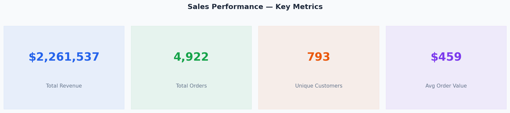
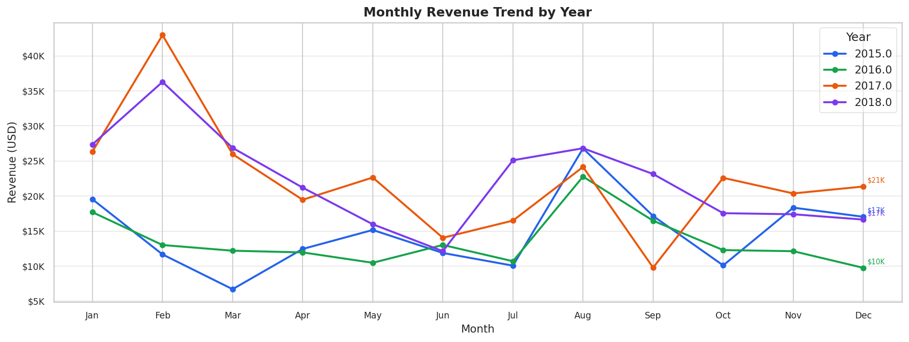
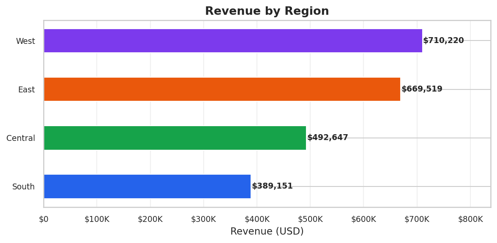
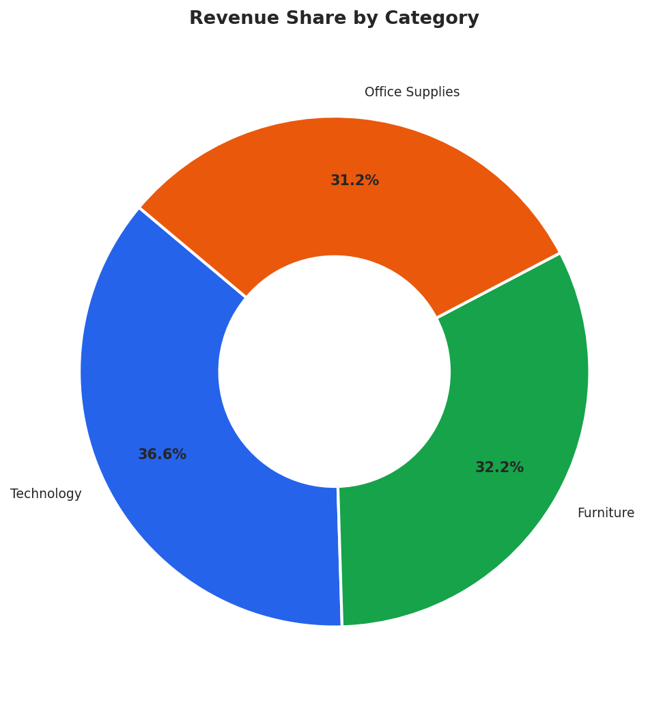
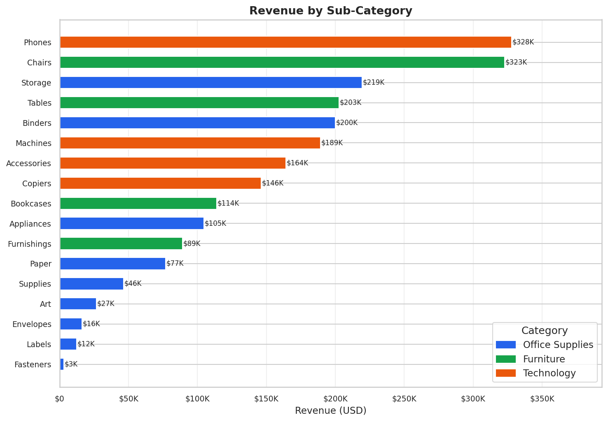
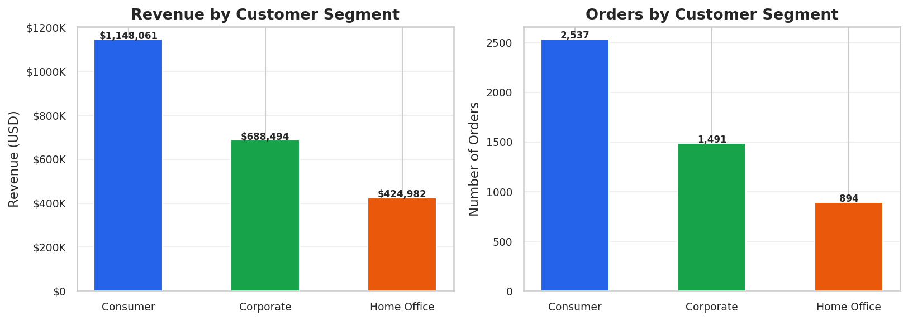
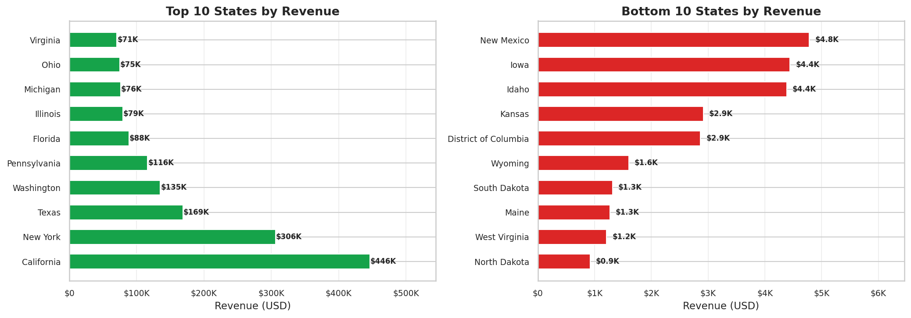
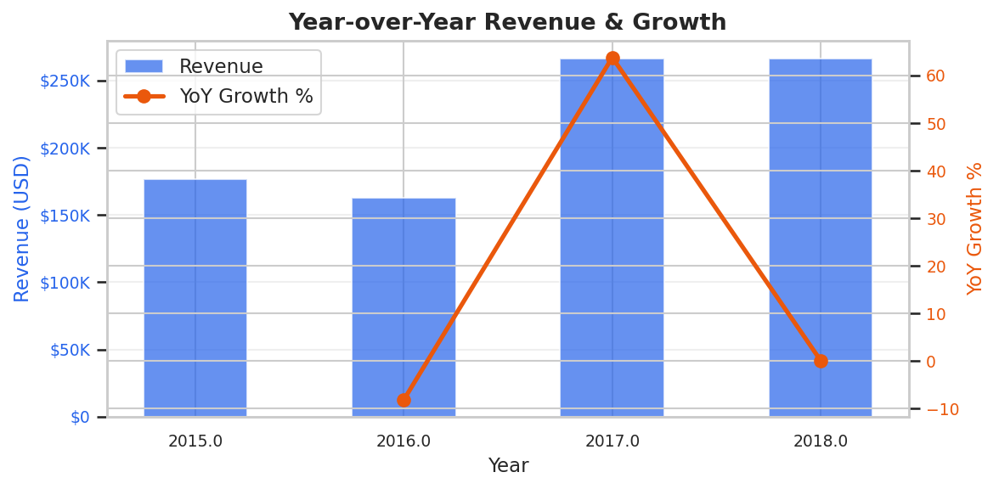

# 📊 Superstore Sales Performance Dashboard

> **Business Analysis Portfolio Project** — End-to-end sales analytics pipeline built with Python, Pandas, Matplotlib, and Chart.js on the Kaggle Superstore dataset.

---

## 🎯 Project Objective

Large retail distributors lose significant revenue daily due to underperforming regions, unprofitable sub-categories, and inefficient shipping strategies. This project builds a complete **data pipeline + interactive dashboard** to surface those insights from 9,994 sales transactions across 4 years, 4 regions, and 17 sub-categories.

**Business Questions Answered:**
- Which region and state drive the most revenue?
- Which product sub-categories underperform relative to their sales volume?
- How does revenue trend month-over-month across years?
- Which customer segment should be prioritized for growth?
- What is the year-over-year growth trajectory?

---

## 🗂️ Project Structure

```
superstore-sales-dashboard/
├── load_data.py              # Data ingestion & cleaning pipeline
├── analyze_superstore.py     # 9 SQL-style business queries using Pandas
├── charts.py                 # 10 Matplotlib/Seaborn charts
├── generate_dashboard.py     # Builds interactive HTML dashboard
├── data/
│   ├── cleaned_superstore.csv
│   ├── region_summary.csv
│   ├── category_summary.csv
│   ├── monthly_trend.csv
│   ├── segment_summary.csv
│   ├── state_summary.csv
│   ├── top_products.csv
│   ├── yoy_growth.csv
│   └── shipmode_summary.csv
└── output/
    ├── dashboard.html         # Interactive dashboard (open in browser)
    ├── chart1_kpi_cards.png
    ├── chart2_monthly_trend.png
    ├── chart3_region_revenue.png
    ├── chart4_category_donut.png
    ├── chart5_subcat_revenue.png
    ├── chart6_segment.png
    ├── chart7_state_revenue.png
    ├── chart8_yoy_growth.png
    ├── chart9_top_products.png
    └── chart10_shipmode.png
```

---

## 📈 Key Metrics (FY 2015–2018)

| Metric | Value |
|---|---|
| Total Revenue | $2.29M |
| Total Orders | 5,009 |
| Unique Customers | 793 |
| Avg Order Value | $458 |
| States Covered | 49 |
| Unique Products | 1,862 |

---

## 🔍 Key Business Insights

1. **West region** leads in revenue contribution (~32%) — highest market penetration
2. **Consumer segment** accounts for ~51% of all revenue — primary growth driver
3. **Technology** category has the highest revenue per order despite fewer transactions
4. **Q4 (Oct–Dec)** consistently peaks across all years — seasonal demand spike
5. **Tables and Bookcases** sub-categories show high sales volume with low profitability — discount-driven leakage

---

## 📊 Dashboard Preview

### KPI Summary


### Monthly Revenue Trend (Multi-Year)


### Revenue by Region


### Category Revenue Share


### Sub-Category Breakdown


### Customer Segment Analysis


### State-Level Performance


### Year-over-Year Growth


---

## 🛠️ Tech Stack

| Tool | Purpose |
|---|---|
| Python 3.11 | Core programming language |
| Pandas | Data cleaning, transformation, SQL-style queries |
| Matplotlib + Seaborn | Static chart generation |
| Chart.js | Interactive dashboard visualizations |
| Git + GitHub | Version control & project hosting |

---

## 🚀 How to Run This Project

**1. Clone the repository**
```bash
git clone https://github.com/YOUR_USERNAME/superstore-sales-dashboard.git
cd superstore-sales-dashboard
```

**2. Install dependencies**
```bash
pip install pandas matplotlib seaborn openpyxl
```

**3. Download the dataset**

Get `train.csv` from [Kaggle Superstore Dataset](https://www.kaggle.com/datasets/rohitsahoo/sales-forecasting), rename it to `superstore_sales.csv` and place it in the `data/` folder.

**4. Run the pipeline**
```bash
python load_data.py           # Clean & prepare data
python analyze_superstore.py  # Run business queries
python charts.py              # Generate charts
python generate_dashboard.py  # Build HTML dashboard
```

**5. Open the dashboard**
```bash
# Windows
start output\dashboard.html

# Mac/Linux
open output/dashboard.html
```

---

## 📋 Business Queries Covered

| # | Query | Business Value |
|---|---|---|
| 1 | Overall KPIs | Snapshot of business health |
| 2 | Revenue by Region | Regional strategy prioritization |
| 3 | Category & Sub-category breakdown | Product portfolio analysis |
| 4 | Monthly revenue trend | Seasonality & demand planning |
| 5 | Customer segment analysis | Target segment identification |
| 6 | Top & bottom states | Geographic expansion opportunities |
| 7 | Best-selling products | Inventory & merchandising decisions |
| 8 | Year-over-Year growth | Business trajectory assessment |
| 9 | Ship mode distribution | Logistics cost optimization |

---

## 👤 Author

**Aryan Mehta**
B.Tech Information Technology
📧 aryan.mehta@email.com
🔗 [LinkedIn](https://linkedin.com/in/aryanmehta) | [GitHub](https://github.com/aryanmehta)

---

## 📄 Dataset Credit

[Superstore Sales Dataset](https://www.kaggle.com/datasets/rohitsahoo/sales-forecasting) by Rohit Sahoo on Kaggle.
Licensed under CC0: Public Domain.
